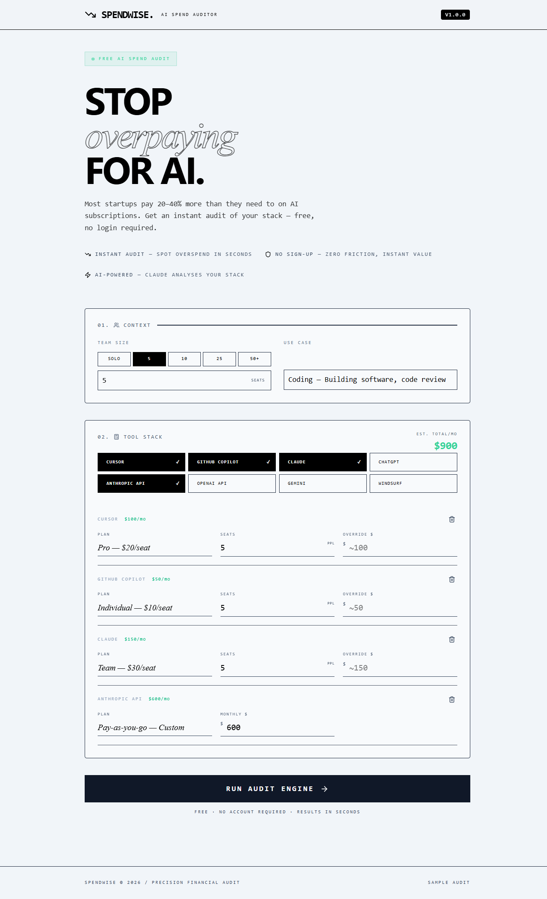
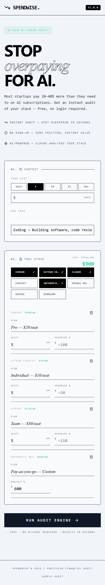
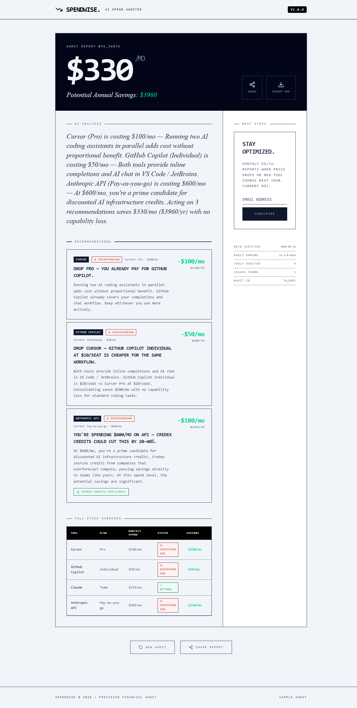
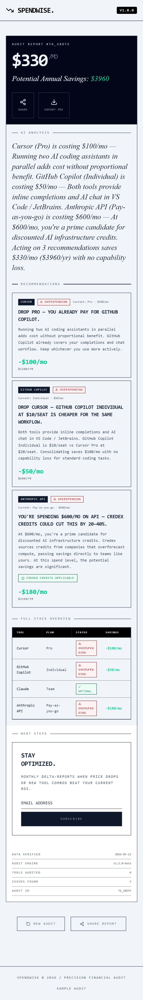

# SpendWise — AI Spend Auditor

SpendWise is a free web app that audits your team's AI tool spend in seconds. Input what you pay for Cursor, Claude, ChatGPT, GitHub Copilot, and others — get an instant breakdown of where you're overspending, what to switch, and exactly how much you'd save. Built for startup founders and engineering managers who suspect they're overpaying but have no benchmark.

**Built as the Round 1 submission for [Credex](https://credex.rocks).**

---

## Live URL

> `https://spendwise-roan-six.vercel.app`

## Demo

SpendWise analyzes your AI tool stack and finds cheaper alternative without switching workflows.

### 1. Input your current stack
Add team size, use case, and current AI tools. Takes 30 seconds.

<p align="center">
    
    <br>
    <em>Desktop</em>
</p>

<p align="center">
    
    <br>
    <em>Mobile</em>
</p>

### 2. Get your optimization report
See monthly/annual savings, specific tool recommendations, and optimization status comparison.

<p align="center">
    
    <br>
    <em>Desktop - $330/mo savings detected</em>
</p>

<p align="center">
    
    <br>
    <em>Mobile</em>
</p>

---

## Quick Start

### Run locally

```bash
git clone https://github.com/araul284/spendwise
cd spendwise
npm install
cp .env.example .env.local   # add your keys (optional)
npm run dev
```

Visit `http://localhost:5173`. The app works fully without any env vars configured.

### Environment variables

```
VITE_SUPABASE_URL=        # from supabase.com → project settings → API
VITE_SUPABASE_ANON_KEY=   # from supabase.com → project settings → API
VITE_ANTHROPIC_API_KEY=   # from console.anthropic.com
```

Without these, the app falls back to localStorage (audits) and templated summaries (AI). Fully functional for demo and development.

### Set up Supabase

1. Create a project at supabase.com
2. Run `supabase-schema.sql` in the SQL editor
3. Copy URL and anon key to `.env.local`

### Deploy to Vercel

```bash
npx vercel --prod
```

Add env vars in Vercel dashboard → Settings → Environment Variables.

### Run tests

```bash
npm test
```

---

## Decisions

Five trade-offs made during the build:

1. **Audit engine is 100% client-side and synchronous.** Results appear instantly — zero loading state for the audit itself. The trade-off: we can't A/B test rule changes without a client deploy, and can't log inputs server-side without an explicit save call.

2. **Pricing data hardcoded in TypeScript.** A DB table + admin UI would allow price updates without deploys. For an MVP shipped in one week, a typed `tools.ts` with cited sources is faster to audit and impossible to corrupt from a bad UI update. Accept needing a deploy for price changes.

3. **No auth, ever.** Email capture after showing value is strictly better UX than sign-up gates. Share URLs solve the recall problem without auth complexity. The trade-off: users can't browse audit history (they re-input or use the share link).

4. **localStorage as Supabase fallback.** Lets the app run as a fully offline demo — useful for reviewers, restricted environments, and local dev. The trade-off: no cross-device persistence, no server-side analytics without Supabase configured.

5. **CSS animations over Framer Motion.** Saves ~30KB gzip and removes a runtime dependency. `animation-delay` staggering achieves the fade-up sequence needed. The trade-off: transitions are less composable and harder to interrupt mid-animation.